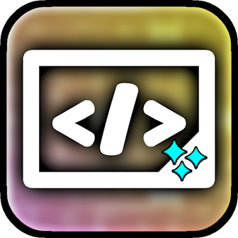

# [](https://www.geode-sdk.org/mods/cheeseworks.moddevbranding) Mod Developer Branding
Developer branding on mod info popups.

## Development
Let's start off by adding this mod as a dependency in your `mod.json`!
```jsonc
"dependencies": {
    "cheeseworks.moddevbranding": {
        "importance": "suggested",
        "version": ">=1.0.0"
    }
}
```

You can directly access the Mod Developer Branding optional API by including the [`OptionalAPI.hpp`](OptionalAPI.hpp) file in your code. Make sure to include the **`branding`** namespace to directly access all needed classes and methods.
```cpp
#include <cheeseworks.moddevbranding/include/OptionalAPI.hpp>

using namespace branding;
```

### Classes
Here are some important classes we highly suggest you keep in mind while working with the API.

#### class `branding::BrandingManagerV2`
The optional manager class for `BrandingManager`.
- `static Result<>` **`registerBrand(std::string const& modId, std::string const& image, BrandImageType type = BrandImageType::Sprite)`**: Register your very own branding image to appear on your mod! Internally checks for duplicate mod entries
  - `std::string const&` **`modId`**: ID of the mod to apply branding on
  - `std::string const&` **`image`**: Sprite name, sheet frame name, or URL of the image to use as branding on this mod
  - `BrandImageType` **`type`**: Whether you're using a sprite, spritesheet frame, or external URL as the source of your branding

#### enum class `branding::BrandImageType`
An enum class that defines the type of image source for your branding.

#### Summary
| Type         | Name                | Description                        |
| ------------ | ------------------- | ---------------------------------- |
| `class`      | `BrandingManagerV2` | Manager for mod developer branding |
| `enum class` | `BrandImageType`    | Defines where an image comes from  |

### Branding
You can register a brand for your mod through this optional API.

#### Registering
To register your very own fabulous branding for your mod, you can call **`BrandingManagerV2::registerBrand`** inside an `$execute` block.

*Required fields are, in order: `modId` and `image`. Optional field is `type`.*

```cpp
$execute{
    BrandingManagerV2::registerBrand(
        "me.mymod",
        "my-sprite-image.png"_spr
    );
};
```

You can include the optional field **`type`** as well! You can set it to `BrandImageType::URL` if you want to include an external image URL as the image source for your branding. With `BrandImageType::Sprite`, you can provide a separate sprite image as your mod branding, and `BrandImageType::SpriteFrame` if you're providing a sprite that is included in a spritesheet.

```cpp
$execute{
    BrandingManagerV2::registerBrand(
        "me.mymod",
        "my-sprite.png"_spr,
        BrandImageType::SpriteFrame
    );
};
```

Congrats! Your branding image will now load on your mod info popup if the user chooses to load the mod.

> [!NOTE]
> *With this method, your branding will **only** load once your mod is installed and loaded. To cover all of your mods with a base branding image before users decide to download your mods, head to **[moddev.cheeseworks.gay](https://moddev.cheeseworks.gay/)** to access the dashboard to manage your universal mod developer branding.*

*Happy modding!*